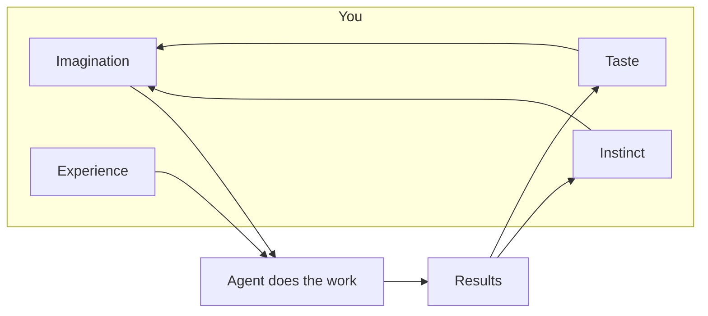

# Agentic Research Toolkit

Notes, templates, and skills for using agentic tools (mainly Claude Code) in research, from a plant genomics PhD student who uses them most days.

**[Read the guide](https://chenhsieh.github.io/agentic-research-toolkit/)**. Start with [How I actually use it](https://chenhsieh.github.io/agentic-research-toolkit/how-i-use-it.html): what I ask for, what makes it work, what went wrong, and a first-week plan.

## The idea

Agentic coding is a medium, not the point. It makes doing things cheap. What to do, and whether the answer is right, still comes from you.

- **Imagination** asks the question.
- **Experience** knows what usually goes wrong, and writes it into the rules file.
- **Instinct** notices when a result is too clean.
- **Taste** decides what is worth doing next.

Then: [A framework](https://chenhsieh.github.io/agentic-research-toolkit/framework.html) (question, context, doing, checking, keeping) and the [Playbook](https://chenhsieh.github.io/agentic-research-toolkit/playbook.html) (prompts, a CLAUDE.md skeleton, plotting rules, and workflows).

The skills here are mostly about checking results: finding the confound, giving a statistic a null, running the check most likely to kill a finding.

## What's in here

| Path | What |
| --- | --- |
| [`docs/`](docs/) | The beginner on-ramp, served as a [site](https://chenhsieh.github.io/agentic-research-toolkit/). Long-form write-ups live alongside as Markdown. |
| [`skills/`](skills/) | Portable `SKILL.md` workflows: named, tool-scoped procedures for Claude Code or as a plain checklist. |
| [`setup/`](setup/) | Universal `CLAUDE.md`: session durability, bash discipline, data safety, provenance, citation integrity. Drop into `~/.claude/` or a project root. |

## Skills

Four compose in order, and each is designed to output something you did not want to hear:

| Skill | Purpose |
| --- | --- |
| [`design-confound-audit`](skills/design-confound-audit/) | Which questions can this design answer? Run before choosing a test. |
| [`statistic-null`](skills/statistic-null/) | Give a derived statistic its own null before believing it. |
| [`result-autopsy`](skills/result-autopsy/) | Execute the checks most likely to kill your own finding. |
| [`second-opinion-concordance`](skills/second-opinion-concordance/) | Independent second method; the disagreements are the product. |

Plus:

| Skill | Purpose |
| --- | --- |
| [`accession-paper-crosswalk`](skills/accession-paper-crosswalk/) | Link an SRA/BioProject accession to its paper and back; the gaps are the finding. |
| [`tikz-figures`](skills/tikz-figures/) | Template-first TikZ/pgfplots figures that match the manuscript's fonts. |
| [`ml-genomics-best-practices`](skills/ml-genomics-best-practices/) | Checklist-driven workflow for defensible ML in genomics. |
| [`scientific-schematics`](skills/scientific-schematics/) | Workflow diagrams as interactive HTML with SVG export. |
| [`trait-gene-miner`](skills/trait-gene-miner/) | Mine validated trait–gene associations into an interactive dashboard. |
| [`ecosystem-mapper`](skills/ecosystem-mapper/) | Map research fields and funding landscapes as network graphs. ⚠ Port incomplete: a design document, not a runnable procedure. |

Six are original to this repo; four are adapted from upstream community / Anthropic examples, `SKILL.md` only. See [`skills/README.md`](skills/README.md) for attribution and porting caveats.

## Companion repo

[`sapelo2-boilerplate`](https://github.com/ChenHsieh/sapelo2-boilerplate): a worked HPC case built on this repo's `setup/CLAUDE.md`.

## Honest limits

- Skills written against a specific tool version or data schema will rot. Re-verify anything load-bearing.
- Agents summarizing literature sometimes cite papers that don't support the claim. Spot-check before it leaves the chat window.
- Long sessions lose intermediate reasoning to compaction. Task lists and tracker docs are the backup; conversation is not durable.
- Discovery-oriented skills still filter through what the agent knows. Genuinely novel findings need a human to notice the output is strange.

Not a tutorial, not a benchmark, not a framework. Markdown files and shell snippets you copy, fork, and modify.

## License

Code [MIT](LICENSE); content [CC BY 4.0](LICENSE-CONTENT). Fork, adapt, attribute.

By [Chen Hsieh](https://github.com/ChenHsieh): bioinformatics PhD candidate. Issues and pull requests welcome.
